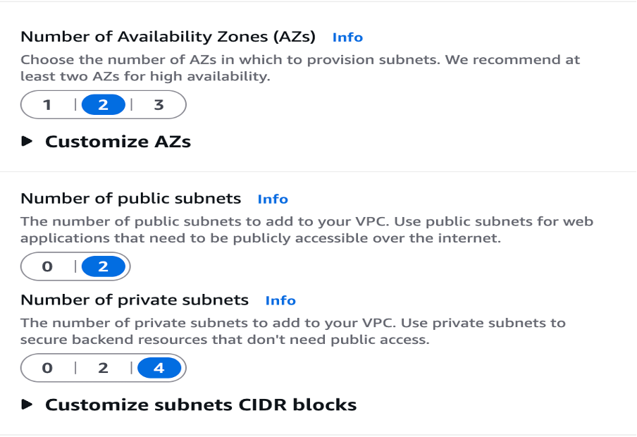
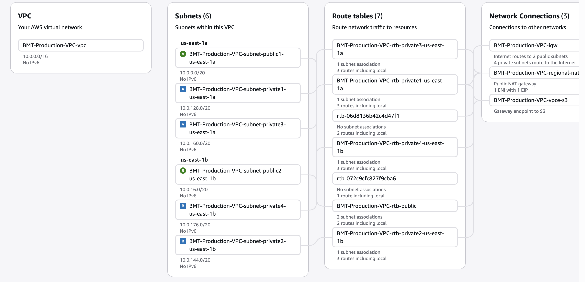
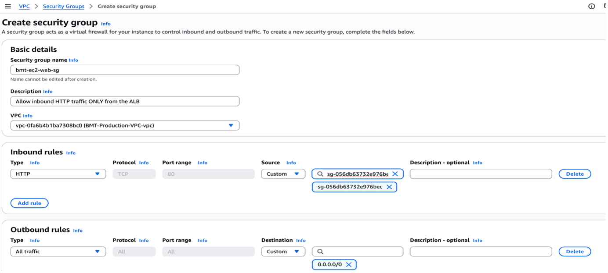
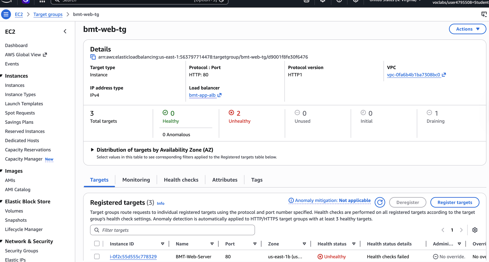
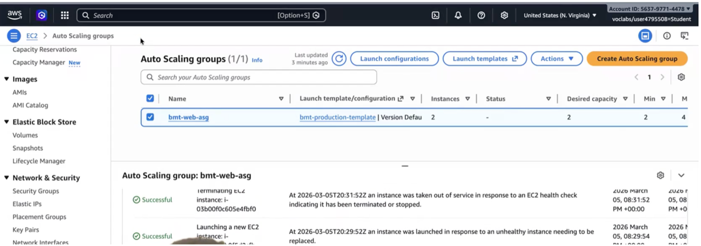
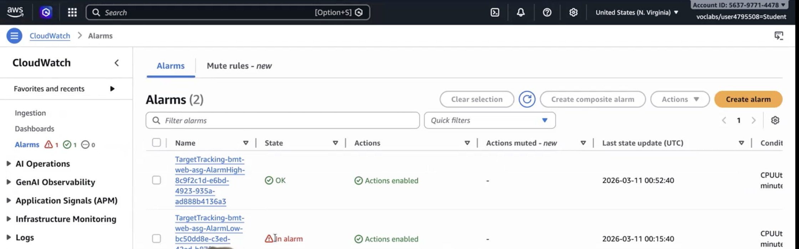

# 🛡️ AWS Cloud Infrastructure & Security Architecture
### BMT Marine Research — Secure, Scalable & Highly Available AWS Deployment

---

## 🔗 Quick Navigation
- [Overview](#-overview)
- [Architecture Diagram](#%EF%B8%8F-architecture-diagram)
- [Project Metrics](#-project-metrics)
- [Services Deployed](#%EF%B8%8F-services-deployed)
- [Architecture Decisions](#-architecture-decisions)
- [Build Walkthrough](#%EF%B8%8F-build-walkthrough)
- [Risk Assessment](#%EF%B8%8F-risk-assessment)
- [Engineering Problems Solved](#-three-engineering-problems-solved)
- [Production Roadmap](#-production-improvement-roadmap)
- [Skills Demonstrated](#-skills-demonstrated)

---

## 📌 Overview
BMT is a marine research organisation that gathers and analyses data about the oceans, weather conditions, and the environment to support scientific research and operational planning.

This project demonstrates the design and deployment of a secure, highly available, and cost-optimised AWS environment capable of supporting those workloads. The architecture was designed around three key business requirements:

1. **Keep services running even if underlying infrastructure fails.**
2. **Protect sensitive telemetry and research data**.
3. **Keep tight control over cloud costs**.

The end result combines network isolation, automated scaling, high availability, encryption, monitoring, and audit logging into a production-style AWS deployment.

---

## 🗺️ Architecture Diagram

> **Visual Proof: Complete Architecture**
> *The final architecture showing network segmentation, security boundaries, application flow, and high-availability design.*
>
> 

---

## 📊 Project Metrics

| Metric | Value |
| :--- | :--- |
| **Availability Zones** | 2 |
| **Public Subnets** | 2 |
| **Private Subnets** | 4 |
| **Load Balancers** | 1 Application Load Balancer |
| **Auto Scaling Range** | 2–4 EC2 Instances |
| **Database** | RDS MySQL Multi-AZ |
| **Cache Layer** | ElastiCache Redis |
| **Storage** | S3 + Glacier Flexible Retrieval |
| **Monitoring** | CloudWatch |
| **Auditing** | CloudTrail |
| **Encryption** | AWS KMS (AES-256) |

### Key Outcomes
- ✅ Multi-AZ resilience
- ✅ Private application and database tiers
- ✅ Automated horizontal scaling
- ✅ Encrypted storage
- ✅ Continuous monitoring
- ✅ Immutable audit logging
- ✅ FinOps-driven architecture

---

## 🛠️ Services Deployed

| Layer | Service | Purpose |
| :--- | :--- | :--- |
| **Network** | VPC, Subnets, Route Tables, NAT Gateway | Network segmentation and isolation |
| **Edge** | Application Load Balancer | Public entry point |
| **Compute** | EC2, Launch Templates, Auto Scaling Group | Scalable application tier |
| **Database** | Amazon RDS MySQL Multi-AZ | Relational database platform |
| **Cache** | ElastiCache Redis | Reduce database load |
| **Storage** | Amazon S3 + Glacier | Telemetry storage and archiving |
| **Security** | Security Groups, IAM, KMS | Access control and encryption |
| **Monitoring** | CloudWatch | Infrastructure monitoring |
| **Auditing** | CloudTrail | Activity logging and forensic visibility |

---

## 🧠 Architecture Decisions

Every major design decision was evaluated against three competing priorities: **Security**, **Availability**, and **Cost**.

### Why Amazon RDS Instead of MySQL on EC2?
**Selected:** Amazon RDS Multi-AZ
**Reasons:**
* Automated backups
* Built-in failover
* Reduced administrative overhead
* Faster disaster recovery
* Better operational resilience

### Why ElastiCache Redis?
Repeated dashboard and analytics queries can overload relational databases. Redis was introduced to:
* Reduce read pressure on RDS
* Improve response times
* Increase scalability
* Improve user experience

### Why a Single NAT Gateway?
Traditional highly available deployments typically use one NAT Gateway per Availability Zone. For this project:
* Fixed infrastructure costs were reduced.
* Routing complexity was simplified.
* Resilience remained acceptable for project requirements.
* *This reflects a balance between engineering requirements and financial governance.*

### Why Immutable Infrastructure?
Instead of manually configuring servers, Launch Templates define server configurations, User Data scripts automate provisioning, and Auto Scaling automatically creates identical replacements. 
**Benefits include:**
* Reduced human error
* Faster recovery
* Consistent deployments
* Improved security

---

## 🏗️ Build Walkthrough

The infrastructure was built across four phases.

### Phase 1 — Foundation and Isolation (VPC)
In the first phase, we focused on building a solid and secure network foundation that could support highly available workloads. We deployed a custom VPC (10.0.0.0/16) across two Availability Zones. 

The network contains 2 Public Subnets, 2 Private Application Subnets, 2 Private Data Subnets, an Internet Gateway, a NAT Gateway, Route Tables, and a VPC Endpoint for S3.

> **Visual Proof: Initial Network Deployment**
> 

> **Visual Proof: Network Routing & Isolation**
> 

* **Security Outcome:** Application servers, databases, and cache nodes remain isolated within private subnets and are never exposed to the internet directly.
* **FinOps Outcome:** A single Regional NAT Gateway was selected to reduce recurring operational costs while maintaining acceptable resilience.

### Phase 2 — Secure Data Layer (RDS & ElastiCache)
The data layer was deployed entirely within private subnets.

**Amazon RDS MySQL Multi-AZ**
RDS was configured using Multi-AZ deployment. AWS automatically provisions a standby database instance in a second Availability Zone to provide failover capability.
* **Benefits:** Automatic failover, increased availability, database redundancy, reduced recovery time.

> **Visual Proof: Database Resilience**
> 

**ElastiCache Redis**
Redis was deployed to improve application performance and reduce database load.
* **Benefits:** Faster data retrieval, reduced database utilisation, improved scalability.

**Amazon S3 Storage**
Environmental data collected by BMT is stored in Amazon S3. In order to optimise cost, lifecycle policies automatically transition older data into Glacier Flexible Retrieval after 30 days.
* **Security Controls:** AWS KMS encryption, VPC Gateway Endpoint, Lifecycle management, Private network routing.

> **Visual Proof: Storage Optimisation**
> 

### Phase 3 — Compute and Scalability (EC2 & ASG)
The application layer was designed around automation and elasticity.

**Immutable Infrastructure**
Each EC2 instance is launched using a Launch Template and User Data bootstrap script. Instances automatically install Apache, configure the web service, and join the Auto Scaling Group. No manual server configuration is required.

**Security Group Architecture**
A layered security model was implemented. Traffic flow follows: `Internet` → `Application Load Balancer` → `EC2 Application Servers` → `RDS Database`.

> **Visual Proof: Security Group Controls**
> 

* **Security Outcome:** Application servers do not accept direct internet traffic. All requests must first pass through the Application Load Balancer.

**Target Group Configuration**
The Application Load Balancer routes traffic only to healthy instances.

> **Visual Proof: Target Group Health**
> 

**Auto Scaling**
The Auto Scaling Group was configured to automatically adapt to demand while maintaining strict cost controls.
* **Minimum Capacity:** 2
* **Desired Capacity:** 2
* **Maximum Capacity:** 4
* **Scaling Trigger:** CPU Utilisation

> **Visual Proof: Auto Scaling Activity**
> 

### Phase 4 — Edge Delivery and Auditing
CloudFront and AWS WAF were originally planned as perimeter security controls. However, the AWS Learner Lab IAM role explicitly denied permissions for CloudFront deployment. Instead of leaving the requirement unaddressed, alternative security controls were used to achieve a similar level of protection.

**CloudTrail Audit Logging**
CloudTrail was enabled across the entire environment. It records API activity, Security Group modifications, IAM events, and resource changes.
* **Security Outcome:** Provides complete forensic visibility and accountability across the AWS environment.

**CloudWatch Monitoring**
CloudWatch alarms continuously monitor infrastructure performance. Scaling policies automatically create alarms for scale-out and scale-in events.

> **Visual Proof: Automated Monitoring**
> 

* **Outcome:** The environment automatically responds to workload changes without manual intervention.

---

## ⚠️ Risk Assessment

| Risk | Impact | Mitigation |
| :--- | :--- | :--- |
| **Database failure** | High | RDS Multi-AZ |
| **Availability Zone outage** | High | Multi-AZ deployment |
| **Traffic spikes** | High | Auto Scaling |
| **Server compromise** | Medium | Private subnets and Security Groups |
| **Storage growth** | Medium | S3 Lifecycle Policies |
| **Unauthorized changes** | High | CloudTrail logging |
| **Excessive cloud costs** | Medium | Scaling limits and FinOps controls |

**Security Perspective:** The environment follows a defence-in-depth strategy where multiple layers of security work together to secure the environment. No single control is expected to provide complete protection.

---

## 🎯 Three Engineering Problems Solved

**1. Controlling Infrastructure Costs**
* **Controls implemented:** Single Regional NAT Gateway, S3 Lifecycle Policies, Auto Scaling maximum limits, Service right-sizing.
* **Outcome:** Infrastructure remains predictable and financially sustainable.

**2. Protecting Sensitive Data**
* **Controls implemented:** Private subnets, Security Group chaining, AWS KMS encryption, S3 VPC Endpoint.
* **Outcome:** Data remains protected both in transit and at rest.

**3. Navigating IAM Restrictions**
* **Constraints encountered:** Customer Managed KMS Keys, CloudFront, Enhanced RDS Monitoring blocks.
* **Response:** Implemented compensating controls, documented limitations, and defined production upgrade paths.
* **Outcome:** Security objectives remained satisfied despite environmental constraints.

---

## 🚀 Production Improvement Roadmap

If deployed in a production environment, the following enhancements would be implemented:

**Security**
* AWS WAF
* CloudFront CDN
* Customer Managed KMS Keys
* AWS Security Hub
* Amazon GuardDuty
* AWS Config

**Resilience**
* Cross-region disaster recovery
* Route 53 failover routing
* Cross-region S3 replication

**Observability**
* Enhanced RDS Monitoring
* CloudWatch Dashboards
* Centralised log aggregation

**DevOps**
* Terraform Infrastructure as Code
* GitHub Actions CI/CD Pipeline
* Automated security scanning
* Compliance validation

---

## 🚀 Skills Demonstrated

| Skill Area | Evidence |
| :--- | :--- |
| **Cloud Architecture** | Multi-tier VPC design |
| **Security Engineering** | Defence-in-depth controls |
| **High Availability** | Multi-AZ deployment |
| **FinOps** | Cost-governed infrastructure |
| **Automation** | Launch Templates and Auto Scaling |
| **Monitoring** | CloudWatch |
| **Auditing** | CloudTrail |
| **Problem Solving** | Compensating controls for IAM restrictions |
| **Technical Documentation** | Architecture decisions and trade-off analysis |

---

## 🎓 Project Context
This project was developed as part of my MSc Cloud and Network Security, and focuses on translating network defence principles into a practical cloud architecture using AWS services and industry-standard design patterns.

---

## 💻 Technologies Used
AWS VPC • EC2 • Auto Scaling • Application Load Balancer • RDS MySQL • ElastiCache Redis • S3 • Glacier • CloudWatch • CloudTrail • IAM • KMS
