# AWS Cloud Infrastructure & Security Architecture

### BlueTide Marine Technologies (BMT): a secure, highly available, cost-governed three-tier deployment on AWS

Designed, built and **ran** the public cloud part of a hybrid cloud strategy for a marine technology company. The web tier, database and cache run in private subnets across two Availability Zones, and the only way in from the internet is an Application Load Balancer. Every API action in the account is recorded, and costs are capped by design.

The build was done in an **AWS Academy student lab**, which blocks some AWS services. I tried each blocked control, recorded the denial, and documented a compensating control, a residual risk and the production upgrade path. Every claim below is backed by a screenshot from the live environment, including the places where what was deployed differs from what was designed.

| | |
| :--- | :--- |
| **Workload** | Three-tier web platform for oceanographic and meteorological data analytics |
| **Network** | Custom VPC `10.0.0.0/16`, 6 subnets across 2 AZs, Regional NAT Gateway, S3 Gateway Endpoint |
| **Compute** | Ubuntu 24.04 + Apache on EC2 (`t3.micro`) in an Auto Scaling Group (min 2 / max 4) behind an ALB |
| **Data** | RDS for MySQL 8.4 (Multi-AZ), ElastiCache for Redis 7.1, S3 with a 30-day Glacier lifecycle rule |
| **Security** | Private tiers with no public IPs, encryption at rest, Redis encryption in transit, S3 Block Public Access, multi-region CloudTrail |
| **Result** | Site served through the ALB from 2 healthy instances in 2 AZs ([proof](#proof-it-works)) |
| **Built** | March 2026, as Assignment 2 of my MSc in Cloud and Network Security |

---

## Contents

- [Why This Project Exists](#why-this-project-exists)
- [Why AWS and This Architecture](#why-aws-and-this-architecture)
- [Architecture](#architecture)
- [Proof It Works](#proof-it-works)
- [Network Design](#network-design)
- [Build and Evidence](#build-and-evidence)
- [Security Controls](#security-controls)
- [Monitoring and Auditing](#monitoring-and-auditing)
- [Cost Governance and Sustainability](#cost-governance-and-sustainability)
- [Working Within AWS Student Lab Limits](#working-within-aws-student-lab-limits)
- [Engineering Problems Solved](#engineering-problems-solved)
- [Residual Risks](#residual-risks)
- [Design Decisions and Alternatives](#design-decisions-and-alternatives)
- [Production Roadmap](#production-roadmap)
- [Skills Demonstrated](#skills-demonstrated)
- [Project Context](#project-context)

---

## Why This Project Exists

### The business problem

BlueTide Marine Technologies (BMT) is a case-study organisation that runs autonomous marine platforms to collect ocean and weather data. It is expanding from **collecting data** to **real-time environmental analytics and predictive modelling**. That shift brings large, unpredictable data volumes, and BMT's on-premises infrastructure cannot scale to meet them economically.

My earlier critical evaluation (Assignment 1) recommended a **hybrid cloud**:

- **Kept on-premises:** BMT's proprietary algorithms, which the Board considered too sensitive to move.
- **Moved to public cloud:** processing of the data streams, which need elastic capacity.

**This project is the public cloud part of that strategy.**

### What the environment had to deliver

| # | Requirement | Why it matters to BMT | How it is met |
| :-: | :--- | :--- | :--- |
| 1 | **Stay available** When infrastructure fails | Analytics and research work can continue even if a server or data centre fails. | Multi-AZ compute and database, ELB health checks, Auto Scaling self-healing |
| 2 | **Protect sensitive data** | The Board raised data sovereignty and confidentiality concerns | Data stays private and secure with private networks, private S3 access, encryption, and blocked public access. |
| 3 | **Control cost** | The Board feared unexpected cloud costs | Cost is controlled with a regional NAT Gateway, Glacier storage, capped scaling, and avoiding unnecessary managed-key costs. |
| 4 | **Scale with demand** | Marine operations can cause data volumes to change sharply. | Target Tracking Auto Scaling on CPU |

---

## Why AWS and This Architecture

AWS was chosen because of three capabilities that map directly onto BMT's requirements:

- **Isolation:** VPCs and Gateway VPC Endpoints keep telemetry traffic off the public internet, which addresses the Board's sovereignty concerns.
- **Automated cost control:** S3 lifecycle rules automatically move old data to Glacier.
- **Repeatable, elastic compute:** Launch Templates and Auto Scaling Groups provide servers that build themselves and scale in and out.

The **three-tier pattern** suits a conventional web analytics platform:

- **Web tier:** a load-balanced tier that can scale out.
- **Data tier:** a managed relational database with a cache in front of it.
- **Storage:** object storage for bulk data.

Heavier options were considered and rejected as over-engineering for this workload. They are covered in [Design Decisions and Alternatives](#design-decisions-and-alternatives).

---

## Architecture

  

<b>Figure 1.</b> Target architecture: network segmentation, security boundaries, application flow and multi-AZ design.

> [!NOTE]
> **Designed vs deployed.** The diagram shows the full target design. The lab build differs in the following places, for the reasons given:
>
> | In the design | Deployed as | Reason |
> | :--- | :--- | :--- |
> | CloudFront + AWS WAF at the edge | Not deployed; the ALB is the internet-facing entry point | **Blocked by the student lab** ([proof](#working-within-aws-student-lab-limits)) |
> | Route 53 DNS | Not deployed; the ALB is reached on its AWS-generated DNS name | Not part of the lab build |
> | HTTPS from users to the ALB | **HTTP listener on port 80 only** | No TLS certificate provisioned in the lab (on the [roadmap](#production-roadmap)) |
> | EC2 servers in their own "ALB-only" security group | Servers share the ALB's security group | Wrong group attached in the launch template, found in post-build review ([details](#post-build-review-finding-security-group-attachment)) |
> | NAT Gateway in each AZ | One **Regional** NAT Gateway | FinOps decision |
> | Customer-managed KMS keys | AWS-managed key on RDS; S3-managed keys (SSE-S3) on S3 | **Blocked by the student lab** |
> | Redis node in each AZ | Single-node Redis cluster (no replicas) | Sized for the proof of concept |

### Request flow (as designed)

1. A user's request reaches the **Application Load Balancer** in the public subnets over HTTP.
2. The ALB forwards it only to **healthy EC2 instances** in the private application subnets, spread across both AZs.
3. The instances read from **ElastiCache for Redis** first, and fall back to **RDS for MySQL** when the data isn't cached.
4. Telemetry is written to **S3** through the **Gateway VPC Endpoint**, so it never crosses the public internet.
5. **CloudWatch** tracks fleet CPU and drives scaling. **CloudTrail** records every API call in the account.

---

## Proof It Works

The architecture was deployed and served traffic end to end.

  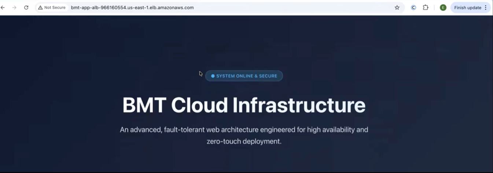

<b>Figure 2. Proof:</b> The BMT site loading from the Application Load Balancer's public DNS name (<code>bmt-app-alb-….elb.amazonaws.com</code>). The page was generated by the User Data bootstrap script (Figure 6) on instances in <b>private</b> subnets, so the only way it could reach the browser is through the ALB. The browser shows <i>Not Secure</i> because the listener is HTTP only; HTTPS is on the roadmap.

  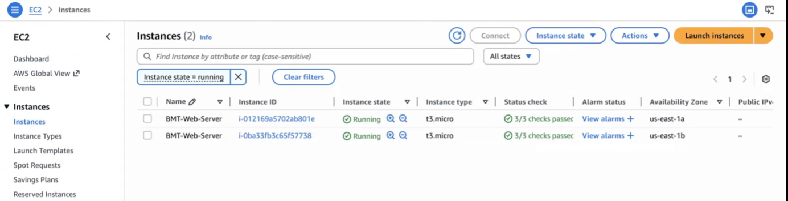

<b>Figure 3. Proof:</b> Two Auto Scaling instances <b>running</b> with <b>3/3 status checks passed</b>, one in <b>us-east-1a</b> and one in <b>us-east-1b</b>. The <i>Public IPv4</i> column is empty (<code>–</code>), so neither server can be reached directly from the internet.

---

## Network Design

  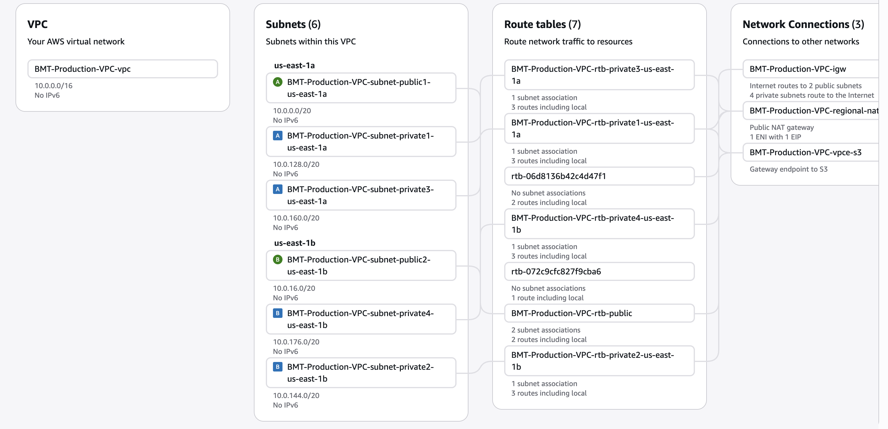

<b>Figure 4. Proof:</b> VPC resource map from the live deployment, showing the subnets, the per-subnet route tables, the Internet Gateway, the Regional NAT Gateway and the S3 Gateway Endpoint.

| Subnet | AZ | CIDR | Tier | Default route |
| :--- | :--- | :--- | :--- | :--- |
| `public1` | us-east-1a | `10.0.0.0/20` | Public: ALB, NAT | Internet Gateway |
| `public2` | us-east-1b | `10.0.16.0/20` | Public: ALB | Internet Gateway |
| `private1` | us-east-1a | `10.0.128.0/20` | Private: application (EC2) | Regional NAT Gateway |
| `private2` | us-east-1b | `10.0.144.0/20` | Private: application (EC2) | Regional NAT Gateway |
| `private3` | us-east-1a | `10.0.160.0/20` | Private: data (RDS, Redis) | Regional NAT Gateway |
| `private4` | us-east-1b | `10.0.176.0/20` | Private: data (RDS, Redis) | Regional NAT Gateway |

**What the resource map shows:**
- Only the two public subnets have a route to the **Internet Gateway**.
- Every private subnet has its **own route table**, and its outbound traffic goes through the NAT Gateway. There is no inbound path from the internet to anything in a private subnet. This is the control that actually keeps the servers off the internet (see the [security group finding](#post-build-review-finding-security-group-attachment)).

  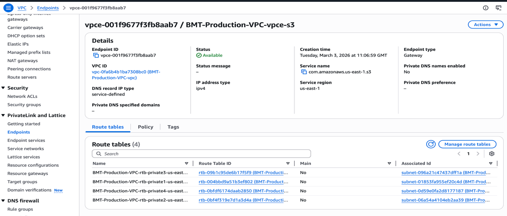

<b>Figure 5. Proof:</b> The S3 Gateway Endpoint is <i>Available</i> and attached to all four private route tables, so traffic from the private tiers to S3 stays on the AWS network.

---

## Build and Evidence

The environment was built in four phases. The screenshots below are the evidence for each layer.

| Phase | Focus | What was built |
| :-: | :--- | :--- |
| **1** | Foundation & isolation | VPC, 2 public + 4 private subnets across 2 AZs, IGW, Regional NAT Gateway, per-subnet route tables, S3 Gateway Endpoint |
| **2** | Secure data layer | DB and cache subnet groups, RDS MySQL Multi-AZ, ElastiCache for Redis, S3 bucket with Glacier lifecycle rule and Block Public Access, encryption at rest |
| **3** | Compute & scalability | Security groups, Ubuntu Launch Template with User Data, Target Group, internet-facing ALB (HTTP:80), ASG in the private application subnets |
| **4** | Auditing & monitoring | Multi-region CloudTrail trail with its own log bucket, and a Target Tracking policy with auto-created CloudWatch alarms. CloudFront and WAF were attempted here and blocked by the lab. |

### Compute tier: immutable and self-healing

Instances are never configured by hand. A **User Data bootstrap script** in the Launch Template installs Apache and publishes the BMT site on first boot. Every instance the Auto Scaling Group launches is therefore identical and ready to serve, and nobody needs to SSH in.

  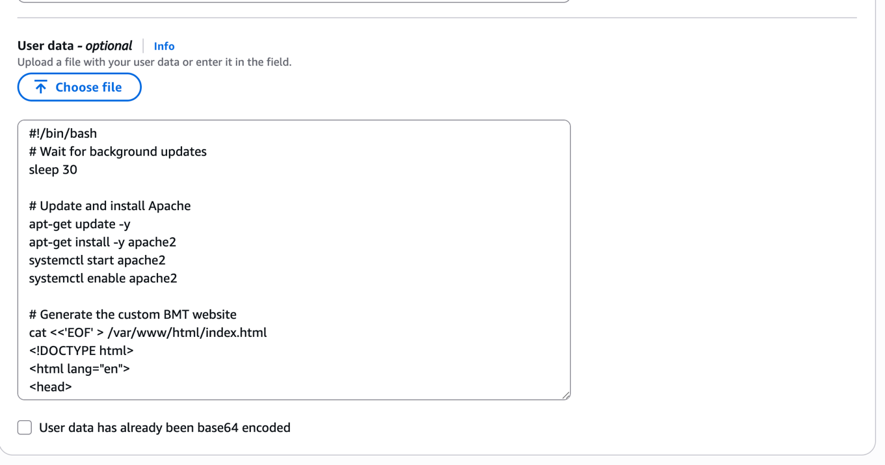

<b>Figure 6. Proof:</b> The User Data bootstrap script in the Launch Template, which provisions every new instance with no manual steps. The page it writes is the one shown in Figure 2.

  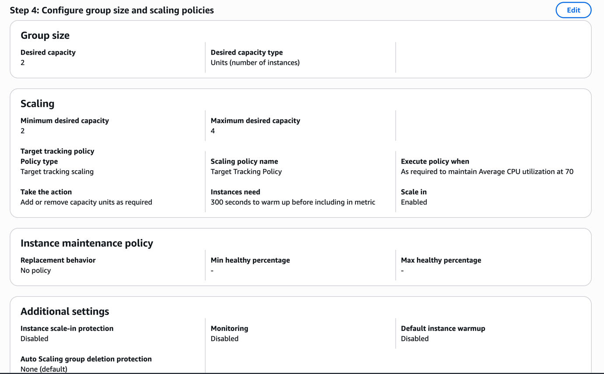

<b>Figure 7. Proof:</b> Auto Scaling Group set to min 2 / max 4, with a Target Tracking policy that keeps average CPU at <b>70%</b>. The hard maximum of 4 caps compute cost.

  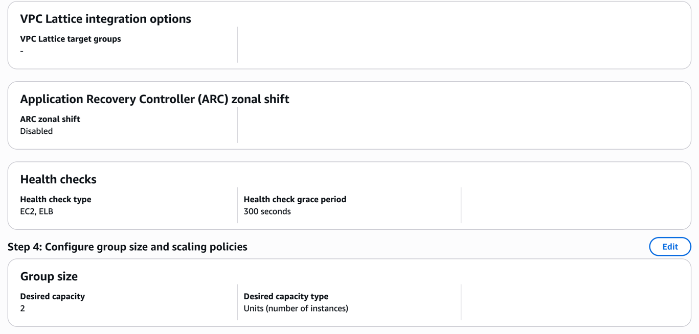

<b>Figure 8. Proof:</b> <b>ELB health checks</b> are enabled alongside EC2 status checks, with a 300-second grace period for the bootstrap to finish. An instance whose Apache service stops responding is replaced, not just one whose VM has failed.

  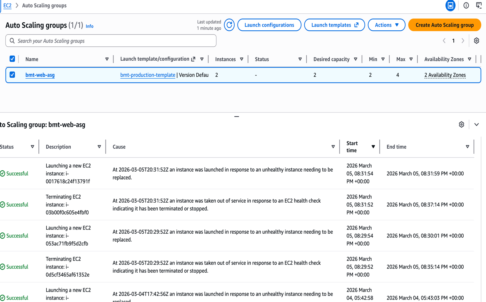

<b>Figure 9. Proof:</b> Self-healing in action. The ASG detects unhealthy instances, terminates them and launches replacements automatically, keeping 2 instances across 2 AZs.

### Data tier: resilient and encrypted

  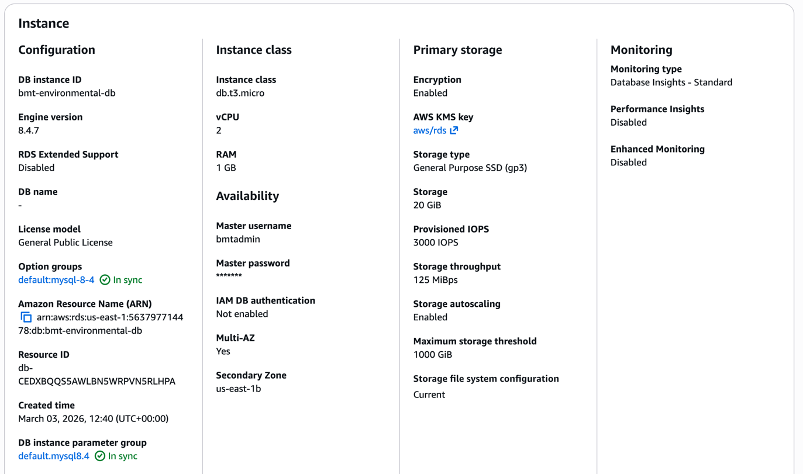

<b>Figure 10. Proof:</b> RDS for MySQL with <b>Multi-AZ: Yes</b> and a standby in <b>us-east-1b</b>, so failover is automatic. Storage is encrypted with the <b>AWS-managed KMS key</b> (<code>aws/rds</code>). Enhanced Monitoring shows as disabled because the lab blocked the role it needs.

  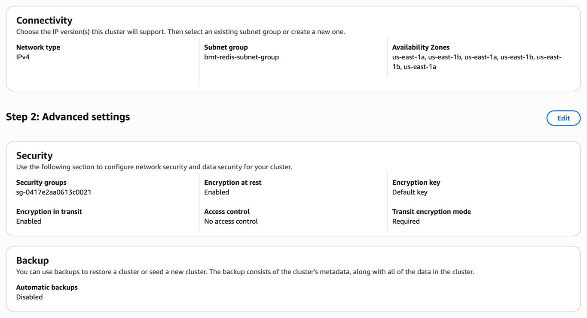

<b>Figure 11. Proof:</b> ElastiCache for Redis in its own private subnet group, with <b>encryption at rest</b> and <b>encryption in transit</b> (mode: <i>Required</i>).

### Storage tier: private, locked down and cost-managed

  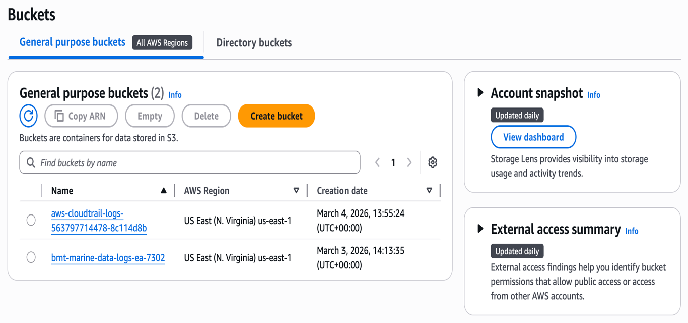

<b>Figure 12. Proof:</b> Separate buckets for application telemetry (<code>bmt-marine-data-logs</code>) and CloudTrail audit logs, so audit evidence is kept apart from application data.

  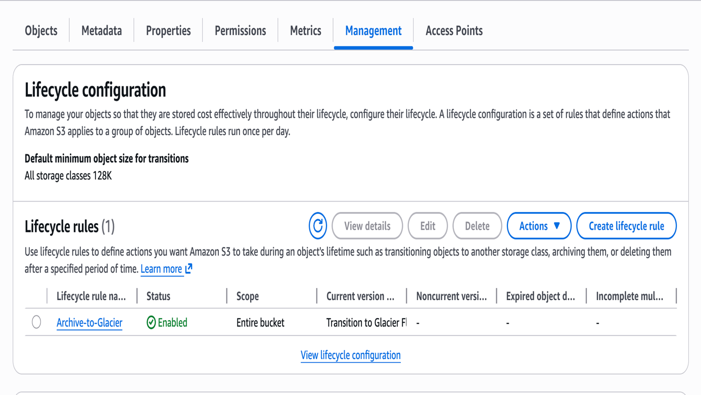

<b>Figure 13. Proof:</b> The <code>Archive-to-Glacier</code> lifecycle rule moves telemetry to <b>Glacier Flexible Retrieval after 30 days</b>. Recent data stays fast to query, and historical data costs much less to keep.

  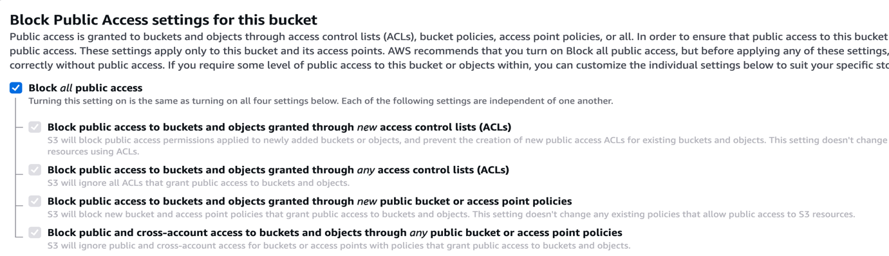

<b>Figure 14. Proof:</b> <b>Block all public access</b> is enabled on the telemetry bucket. The bucket uses S3-managed server-side encryption (<b>SSE-S3</b>, AES-256), not KMS. Moving to SSE-KMS with a customer-managed key is on the roadmap.

---

## Security Controls

The design is **defence in depth**: no single control is relied on to provide complete protection.

| Layer | Control | Threat addressed | Evidence |
| :--- | :--- | :--- | :-: |
| **Perimeter** | ALB is the only internet-facing resource | Direct attacks on servers | Figs. 2, 4 |
| **Network** | Compute and data in private subnets with **no public IPs** and no inbound internet route | Internet exposure of internal workloads | Figs. 3, 4 |
| **Network** | "ALB-only" EC2 security group designed and created, but **not attached** in the lab build | Bypassing the load balancer, lateral movement | Figs. 15, 16 |
| **Data path** | S3 Gateway VPC Endpoint | Telemetry crossing the public internet | Fig. 5 |
| **Data at rest** | RDS: AWS-managed KMS key (`aws/rds`) · S3: SSE-S3 · Redis: at-rest encryption (all AES-256) | Disclosure of stored research data | Figs. 10, 11, 14 |
| **Data in transit** | Redis transit encryption set to *Required* · user-to-ALB traffic is **HTTP** (HTTPS on roadmap) | Interception of cached data | Fig. 11 |
| **Storage** | S3 Block Public Access | Accidental public exposure of buckets | Fig. 14 |
| **Host** | No SSH-based configuration; instances are built from a template | Configuration drift, credential exposure | Fig. 6 |
| **Detective** | Multi-region CloudTrail | Undetected or unattributable changes | Figs. 17, 18 |
| **Availability** | Multi-AZ RDS, ASG across 2 AZs, ELB health checks | Service loss from AZ or instance failure | Figs. 3, 8–10 |

### Post-build review finding: security group attachment

The design calls for **two separate security groups**:
- an ALB group that accepts web traffic from the internet;
- an EC2 group (`bmt-ec2-web-sg`) that accepts HTTP **only from the ALB's group**.

The EC2 group was created correctly (Figure 15). When I reviewed my evidence after the build, I found the launch template had attached the **ALB's group** (`bmt-web-server-sg`) to the servers instead (Figure 16). That group allows ports 80 and 443 from `0.0.0.0/0`.

**Impact:** low in practice, because the servers have no public IP and sit in private subnets with no inbound route from the internet (Figures 3 and 4). However, it removes a layer of defence in depth. Any host inside the VPC could reach the servers directly without going through the ALB.

**Fix:**
1. Publish a new launch template version that attaches `bmt-ec2-web-sg`.
2. Run an ASG instance refresh so every server picks it up.
3. Give the ALB its own dedicated security group, so the two roles are never shared again.

  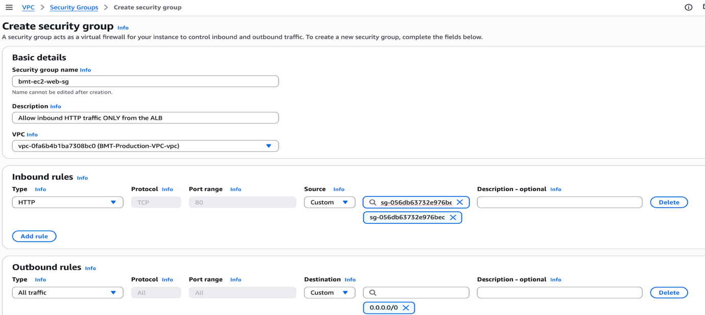

<b>Figure 15. Proof:</b> The intended EC2 security group, <code>bmt-ec2-web-sg</code>, whose only inbound rule is HTTP from the ALB's security group.

  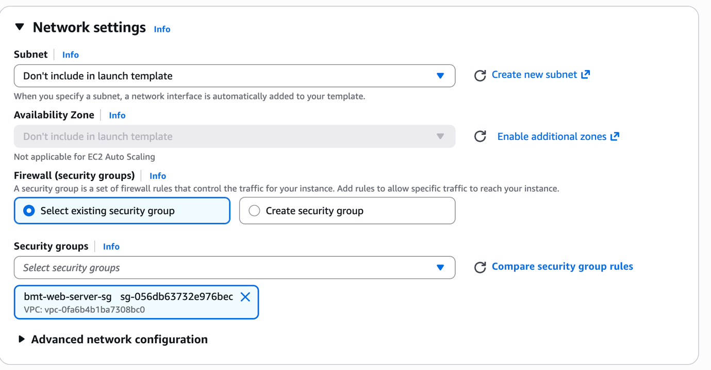

<b>Figure 16. Finding:</b> The launch template attached <code>bmt-web-server-sg</code>, the ALB's own security group, to the servers instead of <code>bmt-ec2-web-sg</code>.

> **Why this matters:** industry analyses attribute most cloud security incidents to customer **misconfiguration**, not provider failure. This finding is a small example of exactly that kind of gap. Checking deployed configuration against the design is what caught it.

---

## Monitoring and Auditing

  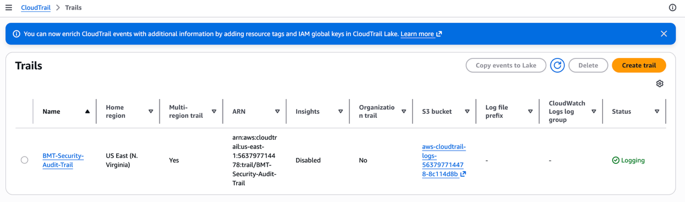

<b>Figure 17. Proof:</b> <code>BMT-Security-Audit-Trail</code> is a <b>multi-region</b> trail in the <i>Logging</i> state, writing to a dedicated S3 bucket.

  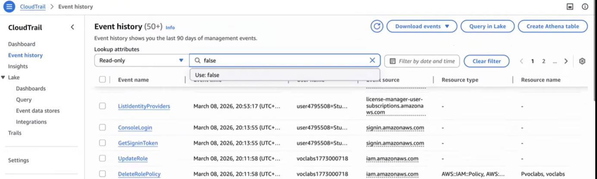

<b>Figure 18. Proof:</b> CloudTrail <b>capturing real activity</b>: console sign-ins and IAM changes such as <code>UpdateRole</code> and <code>DeleteRolePolicy</code>, each recorded with the time, the user and the source service.

  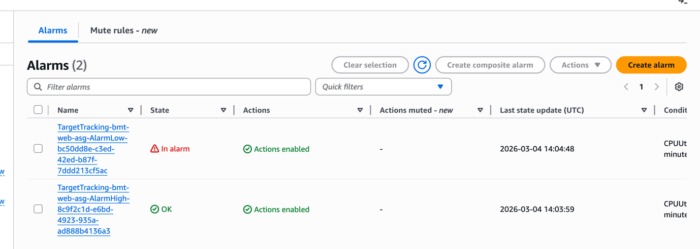

<b>Figure 19. Proof:</b> The Target Tracking policy created the CloudWatch alarms automatically. <i>AlarmHigh</i> triggers scale-out and <i>AlarmLow</i> triggers scale-in, with no manual intervention.

---

## Cost Governance and Sustainability

Moving to the cloud changes spending from fixed capital expenditure (CapEx) to pay-as-you-go operating expenditure (OpEx). That flexibility is what creates the "bill shock" risk the Board was worried about, so cost controls were built into the architecture itself:

| FinOps control | Effect |
| :--- | :--- |
| **Regional NAT Gateway** instead of one per AZ | Keeps outbound access resilient across AZs while cutting fixed hourly networking cost |
| **S3 → Glacier after 30 days** | Historical telemetry kept at a fraction of Standard storage cost |
| **ASG hard maximum of 4** | Elasticity with a ceiling, so a traffic spike can't become a runaway bill |
| **Scale-in enabled, no scale-in protection** | Idle capacity is removed automatically |
| **AWS-managed and S3-managed keys** | No monthly per-key charge |
| **Right-sized services** (`t3.micro`, `db.t3.micro`, `cache.t3.micro`) | Matches the proof-of-concept load |
| **No EKS, VPC Lattice or ARC zonal shift** | Avoids paying for complexity the workload doesn't need |

**Sustainability:** on-premises estates are sized for peak load, so much of their capacity sits idle while still drawing power. Auto Scaling **scales in** when demand drops, so energy use follows the real workload. Running on hyperscale data centres, which are more energy-efficient than typical on-premises facilities, adds to that benefit.

---

## Working Within AWS Student Lab Limits

This environment was built in an **AWS Academy Learner Lab**, the sandbox AWS provides for students. It runs under a fixed IAM role (`voclabs`) that **explicitly denies** a number of actions, to prevent unexpected costs and keep the sandbox safe. Some standard production controls therefore couldn't be deployed, even when correctly configured.

In each case the control was **attempted**, the denial was **recorded**, and a **compensating control** was put in place:

| Unavailable in the lab | What was denied | Alternative control used | Production path |
| :--- | :--- | :--- | :--- |
| **Amazon CloudFront + AWS WAF** | `cloudfront:CreateDistribution` | ALB as the single entry point, private tiers with no public IPs, and CloudTrail auditing (an "assume breach" posture) | CloudFront + WAF managed rule groups in front of the ALB |
| **Customer-managed KMS keys** | `kms:CreateKey` | AWS-managed KMS key on RDS, SSE-S3 on S3, default-key encryption on Redis (all AES-256) | Customer-managed keys with rotation and key policies; SSE-KMS on S3 |
| **RDS Enhanced Monitoring** | Creating `rds-monitoring-role` | Standard CloudWatch RDS metrics | Enhanced Monitoring + Performance Insights |

  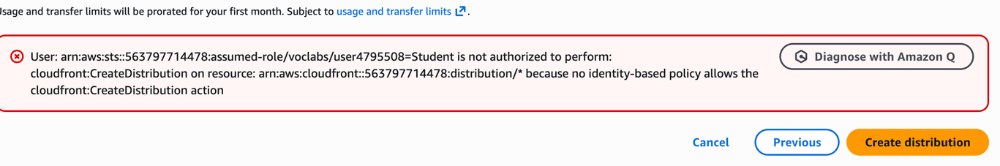

<b>Figure 20. Proof:</b> The lab's student role is denied <code>cloudfront:CreateDistribution</code>, so edge protection could not be deployed. This is why the ALB is the internet-facing entry point.

> [!IMPORTANT]
> These gaps come from the **student lab**, not from the design. The target architecture (Figure 1) includes all of these controls, and each one has a defined production upgrade path.

---

## Engineering Problems Solved

| Problem | Diagnosis | Resolution |
| :--- | :--- | :--- |
| **Blocked edge security** | IAM denied CloudFront and WAF | Moved the focus inward: ALB as the single entry point, private tiers with no public IPs, full audit logging |
| **No customer-managed keys** | IAM denied `kms:CreateKey` | Encrypted RDS with the AWS-managed KMS key and S3 with SSE-S3, so encryption was kept and per-key cost removed |
| **No Enhanced Monitoring role** | IAM blocked creating the monitoring role | Used standard CloudWatch metrics, which are enough for a proof of concept |
| **S3 endpoint route collision** | One private route table already had a prefix-list route (`pl-63a5400a`) for S3 | Associated the endpoint only with route tables without a conflicting route, keeping isolation without breaking routing |
| **Security group drift from the design** | Post-build review found the servers carried the ALB's security group | Documented the impact and the fix (new template version + instance refresh) — [details](#post-build-review-finding-security-group-attachment) |

  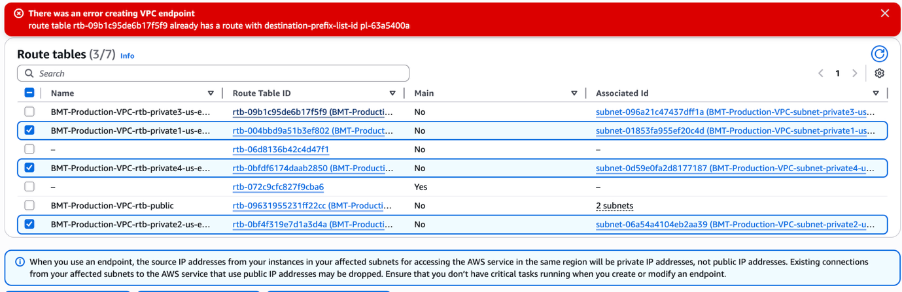

<b>Figure 21. Proof:</b> The route-table conflict met during endpoint creation. Resolving it meant working out how gateway endpoints insert prefix-list routes into route tables.

---

## Residual Risks

| Risk | Cause | Current mitigation | Planned mitigation |
| :--- | :--- | :--- | :--- |
| **Layer 7 attacks** (e.g. HTTP floods, injection) | No WAF or CloudFront in front of the ALB (blocked by the lab) | Private tiers, CloudTrail | CloudFront + AWS WAF |
| **Unencrypted user-to-ALB traffic** | HTTP listener only | Traffic beyond the ALB stays inside the VPC | ACM certificate + HTTPS listener with HTTP → HTTPS redirect |
| **Servers reachable from inside the VPC without going through the ALB** | Servers share the ALB's security group (open on 80/443) | No public IPs; no inbound internet route to private subnets | Attach `bmt-ec2-web-sg` via new launch template version + instance refresh |
| **Key-management lock-in** | Dependence on AWS-managed keys | Encryption at rest is still enforced | Customer-managed keys; review portability for a multi-cloud future |
| **Cache single point of failure** | Single-node Redis | The cache holds no data of record, which stays in RDS | Replica in the second AZ with automatic failover |

---

## Design Decisions and Alternatives

<strong>RDS Multi-AZ, not a database on EC2</strong>

RDS Multi-AZ provides a standby database in a second AZ and automatically fails over if needed, avoiding manual patching, backups, failover, and a single point of failure.

<strong>ElastiCache for Redis in front of RDS</strong>

Analytics dashboards often run the same queries repeatedly. Using Redis to store these results reduces the load on the main database, makes dashboards faster, and helps prevent the database from becoming a bottleneck.

<strong>S3 + Glacier, not EBS</strong>

Block storage is better for active data, not for storing large amounts of old telemetry. Object storage with lifecycle rules is better for data that is used now and archived later.

<strong>Regional NAT Gateway, not one per AZ</strong>

A NAT Gateway in every AZ improves resilience but costs more because each one has hourly and data processing charges. A Regional NAT Gateway provides one managed exit across AZs, reducing costs. This is a deliberate trade-off between resilience and cost.

<strong>What was deliberately left out</strong>

- **Amazon EKS:** a Kubernetes control plane is unjustified overhead for a conventional three-tier app.
- **VPC Lattice:** a service-mesh layer adds cost and complexity when the ALB already handles ingress.
- **ARC zonal shift:** an ASG spread across AZs plus a cross-zone ALB already gives enough resilience at this scale.
- **"Prioritise availability" maintenance policy:** launching replacements before terminating raises cost, so the default mixed behaviour was kept.

---

## Production Roadmap

**Security**
- Attach the dedicated `bmt-ec2-web-sg` to the servers and give the ALB its own security group
- CloudFront + AWS WAF managed rules in front of the ALB
- ACM certificate and HTTPS listener on the ALB (HTTP → HTTPS redirect), plus enforced TLS to RDS
- Customer-managed KMS keys with automatic rotation, and SSE-KMS on S3
- CloudTrail log file validation and S3 Object Lock for tamper-evident audit logs
- Amazon GuardDuty, AWS Security Hub and AWS Config (with a rule to flag security group drift)
- SSM Session Manager for break-glass access, with no SSH keys

**Resilience**
- Redis replica with automatic failover
- Cross-region disaster recovery with Route 53 failover routing, and cross-region S3 replication

**Observability**
- RDS Enhanced Monitoring and Performance Insights
- CloudTrail → CloudWatch Logs with metric filters for real-time security alerting
- CloudWatch dashboards

**Automation**
- Terraform for the whole environment, so security group attachments are defined in code and reviewed
- GitHub Actions CI/CD with IaC security scanning (e.g. Checkov, tfsec)

---

## Skills Demonstrated

| Skill area | Evidence in this project |
| :--- | :--- |
| Cloud architecture | Multi-tier, multi-AZ VPC with explicit public/private tiering, deployed and serving traffic |
| Network security | Route-table isolation, private tiers with no public IPs, Gateway VPC Endpoint |
| Security engineering | Defence-in-depth control mapping, encryption at rest and in transit, audit logging |
| Security review | Found and documented a security group misconfiguration by checking deployed configuration against the design |
| High availability | Multi-AZ RDS, ASG across two AZs, ELB-driven self-healing |
| FinOps | Regional NAT, Glacier lifecycle, capped scaling, managed-key cost avoidance |
| Automation | Launch Templates, User Data bootstrap, Target Tracking scaling |
| Problem solving | Compensating controls for three IAM denials, and diagnosis of a routing conflict |
| Risk management | Residual risk register with planned mitigations |
| Technical documentation | Decision records, trade-off analysis, designed-vs-deployed traceability |

---

## Project Context

This project was completed as an **Assignment** of my **MSc in Cloud and Network Security** at the **University of Greater Manchester**. It followed a critical evaluation of BMT's infrastructure and covers the practical design, implementation and reflection for the public cloud part of the recommended hybrid strategy.

The README describes what was actually deployed. Any differences from the original design, such as security groups, S3 encryption, and the HTTP-only listener, are clearly explained and supported with evidence.

**Technologies:** AWS VPC · EC2 · Auto Scaling · Application Load Balancer · RDS for MySQL · ElastiCache for Redis · S3 · S3 Glacier · VPC Endpoints · NAT Gateway · CloudWatch · CloudTrail · IAM · KMS
